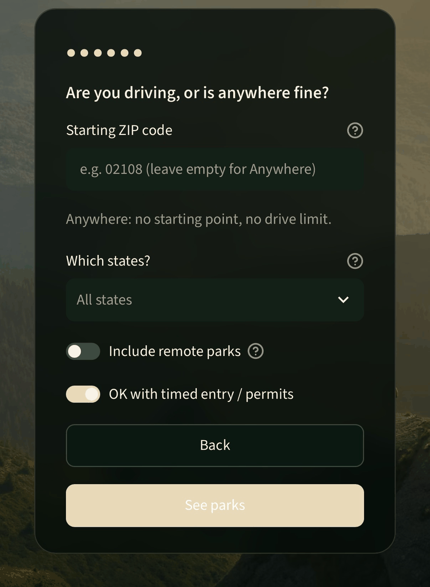

# US Parks Recommender

Describe the trip you want and it ranks all 63 U.S. National Parks for that
trip, with the reason behind every score. It is built for travelers who are
choosing which park to visit.

**Live demo:** https://us-national-parks-recommender.streamlit.app



## How it works

- **Trip profile in:** terrain, activities, days, difficulty, budget, crowd
  preference, month, and optionally a starting point with a driving limit.
- **Match:** cosine similarity between the trip and each park on terrain
  (biomes) and activity tags, with common tags such as hiking weighted down
  (IDF). Days, difficulty and budget score by closeness.
- **Penalties:** parks busier than you want lose points. A park counts one
  crowd level quieter outside its peak months, which come from NPS monthly
  visit data. Months far from a park's best season lose points too.
- **Hard filters:** driving time from your start, access (parks you can only
  fly to drop out when you set a drive limit), states, permits and remote
  parks.
- **Every score explained:** each result shows how much each part added or
  subtracted, plus a one-line reason.

The catalog is the official set of 63 national parks with structured tags.
This repo does not copy editorial content from any product site.

## Results

On all 18 hand-labeled test profiles (train + holdout), from
`python -m src.evaluate`. Higher is better.

| Method | R-Precision | nDCG@5 |
|---|---|---|
| Model | 0.721 | 0.773 |
| Content-only (terrain and activity match alone) | 0.656 | 0.790 |
| Popularity (most NPS visits first) | 0.246 | 0.266 |
| Random | 0.252 | 0.289 |

The profiles are hand-written, so treat this as a regression suite, not a
user study. Train/holdout splits and more baselines are in
[Metrics](#metrics).

## What I learned

- **Baselines matter.** Ranking by popularity (most NPS visits first) scores
  no better than random (R-Precision 0.246 vs 0.252, nDCG@5 0.266 vs 0.289).
  Trip fit matters more than fame.
- **Check what the test can measure.** In two holdout profiles, every park
  left after the hard filters was relevant, so any order scores 1.0. They lift
  holdout R-Precision to 0.794; without them it is 0.692, close to train
  (0.685).
- **Hand-set weights are the weak spot.** Content match alone beats the full
  model on nDCG@5 (0.764 vs 0.745 without the filter-only profiles), although
  the full model leads on R-Precision (0.686 vs 0.614). Adding month-aware
  crowds from NPS data lowered train R-Precision from 0.708 to 0.685. The
  0.12 crowd relief let weaker terrain matches pass better ones, e.g. White
  Sands passed Capitol Reef for a canyon trip in October. The visit data was
  right; the hand-set weights gave crowds too much say.

## What's next

- Collect outside labels: a Google Form (`docs/label-form.md`) where other
  people describe a trip and pick their top 3 parks. These become the
  `external` split, used only for testing.
- Fit the score weights from labeled data instead of setting them by hand,
  then test them on the outside labels.

## Score

```
score = 0.55 * cosine(biome + IDF(tags))
      + 0.18 * days_closeness
      + 0.14 * difficulty_closeness
      + 0.08 * budget_closeness
      − 0.12 * max(0, effective_crowd − wanted_crowd)
      − 0.35 * (month_distance / 6)
```

The last term is `W_MONTH_PENALTY * (month_distance / 6)` with
`W_MONTH_PENALTY=0.35` from `src/recommender.py`.
`month_distance` is the circular months to the nearest `best_months` entry
(December wraps to January). Max distance is 6. Remote parks, permits and
the optional `states` list (two-letter codes, e.g. `["UT"]`) stay hard
filters. Parks that cross state lines are listed under every state they
span, per NPS (Yellowstone `WY,MT,ID`), so `["MT"]` returns Yellowstone.

`effective_crowd` is the park's catalog crowd, except that with a trip month
outside the park's `peak_months` it counts one level quieter (high → medium,
medium → low). No month: catalog crowd. A month is a peak month when its NPS
recreation visits are at least **70% of the park's busiest month**, using the
2023–2025 average. The federal shutdown (Oct 1–Nov 12, 2025) counts as
missing data, not low visits: October and November average 2023 and 2024
only, for every park. Known limit: a single spike month can define the whole
peak, e.g. Gateway Arch peaks only in July (Fourth of July) and Shenandoah
only in October (fall color), so their other months count as quieter.

Drive time is `great_circle_miles × 1.25 / 65 mph`. That is a highway sketch,
not Google Maps. Each park has an `access` value (`road`, `boat`, `flight`).
With a drive limit, parks you can only fly to drop out, and boat parks show
the drive to the port as "~Xh drive + boat". With no drive limit, results say
"flight needed" or "boat needed". `permit_likely` is a coarse 2026-09 snapshot and will go stale.

## Setup

```bash
python -m venv .venv
source .venv/bin/activate
pip install -r requirements.txt
pip install -e .
```

```bash
python -m src.cli --biome desert --tag hiking --tag stargazing \
  --days 2-3 --month 11 --origin san_diego --max-hours 8 --no-remote --explain

python -m src.evaluate
pytest
streamlit run app/streamlit_app.py
```

Starting point: `--zip 02108` (any 5-digit U.S. ZIP in the table below; ZIP+4
like `92101-1234` uses the first five digits) or a
city preset `--origin` (`san_diego`, `los_angeles`, `phoenix`, `denver`,
`seattle`, `salt_lake`, `nyc`). Passing both is an error. A bad ZIP stops
with `ZIP not found`. `--max-hours` only applies with a starting point.

## Metrics

18 hand-written fixtures. Treat them as a **regression suite**, not a blind
holdout or a user study. The holdout was seen during development. Labels were
revised once on 2026-09-21. Weights were not retuned after that pass.

Baselines and ablations use the same hard filters as the model (remote,
permits, drive hours). **Popularity** ranks by average annual NPS
recreation visits, 2023–2025, with the same shutdown handling (ties by
`park_code`). **Random** is the mean of 100 shuffles of the filtered parks
(seeds 0–99). **Content-only** ranks by cosine similarity alone (no days,
difficulty, budget, crowd, or month terms). A profile is **filter-only** when
random scores 1.0 on both metrics — every remaining candidate is relevant, so
ranking cannot change the score.

Holdout averages about 22 candidates after hard filters versus about 42 on
train. Two holdout profiles (`washington_alpine`, `beginner_family_east`) are
filter-only and lift the holdout average; excluding them, holdout and train
R-Precision are close (0.692 vs 0.685).

| Method | Split | n | R-Precision | nDCG@5 |
|---|---|---|---|---|
| Model | Train | 12 | 0.685 | 0.739 |
| Model | Holdout | 6 | 0.794 | 0.842 |
| Model | All | 18 | 0.721 | 0.773 |
| Model (excl. filter-only) | Train | 12 | 0.685 | 0.739 |
| Model (excl. filter-only) | Holdout | 4 | 0.692 | 0.763 |
| Model (excl. filter-only) | All | 16 | 0.686 | 0.745 |
| Popularity | Train | 12 | 0.149 | 0.160 |
| Popularity | Holdout | 6 | 0.442 | 0.479 |
| Popularity | All | 18 | 0.246 | 0.266 |
| Popularity (excl. filter-only) | Train | 12 | 0.149 | 0.160 |
| Popularity (excl. filter-only) | Holdout | 4 | 0.163 | 0.218 |
| Popularity (excl. filter-only) | All | 16 | 0.152 | 0.174 |
| Random | Train | 12 | 0.136 | 0.185 |
| Random | Holdout | 6 | 0.483 | 0.498 |
| Random | All | 18 | 0.252 | 0.289 |
| Random (excl. filter-only) | Train | 12 | 0.136 | 0.185 |
| Random (excl. filter-only) | Holdout | 4 | 0.224 | 0.246 |
| Random (excl. filter-only) | All | 16 | 0.158 | 0.200 |
| Content-only | Train | 12 | 0.588 | 0.751 |
| Content-only | Holdout | 6 | 0.794 | 0.869 |
| Content-only | All | 18 | 0.656 | 0.790 |
| Content-only (excl. filter-only) | Train | 12 | 0.588 | 0.751 |
| Content-only (excl. filter-only) | Holdout | 4 | 0.692 | 0.804 |
| Content-only (excl. filter-only) | All | 16 | 0.614 | 0.764 |

**Ablation finding (weights unchanged):** Excluding filter-only profiles
(n=16), the full model scores R-Prec 0.686 / nDCG@5 0.745, and content-only
scores 0.614 / 0.764. The days, difficulty, budget, crowd, and month terms
raise R-Precision by about 0.07 but do not improve nDCG@5. On holdout,
content-only beats the full model on nDCG@5 (0.804 vs 0.763), but n=4 is too
small to conclude anything.

**Crowd finding (0.6.0):** month-aware crowd lowered train metrics
(R-Prec 0.708 → 0.685, nDCG@5 0.764 → 0.739). In both profiles that lost, a
park that matches the trip less well gains 0.12 from off-peak crowd relief
and passes a relevant park that is at peak. In `quiet_canyon` (October),
White Sands (desert, not a canyon) passes Capitol Reef. In
`avoid_permits_and_flights` (April), Cuyahoga Valley and Great Sand Dunes
push Saguaro out of the top 5. The visit data is right; the hand-set weights
let the crowd term outweigh terrain match, the same pattern as the
content-only ablation above. Weights are unchanged for now; a later task
will fit them from data.

See `CHANGELOG.md` for the 50 mph drive bug. Those older figures are retired.

Yosemite `best_months` was missing July/August in the catalog; that is a
data fix, not a label tweak.

## External labels

Crowd labels from other people use the form in `docs/label-form.md`. Create the
Google Form with `scripts/create_label_form.gs` (generated by
`scripts/build_form_script.py` from the importer's titles/choices). Import a
CSV export with `scripts/import_form_labels.py`. Those profiles get
`split: "external"` and appear on their own evaluate lines. They are for
testing only — never tune on them. The `all` aggregate stays train + holdout.

## ZIP origins

`data/zcta_centroids.csv` maps 5-digit ZIP codes to coordinates (`zip,lat,lon`,
33,791 rows). It comes from the U.S. Census Bureau **2026 Gazetteer Files**,
ZIP Code Tabulation Areas national file (public domain):
https://www2.census.gov/geo/docs/maps-data/data/gazetteer/2026_Gazetteer/2026_Gaz_zcta_national.zip
(index: https://www.census.gov/geographies/reference-files/time-series/geo/gazetteer-files.html).
Each row is the ZCTA's internal point. ZCTAs approximate USPS ZIP codes; a
PO-box-only or brand-new ZIP may be missing. Rebuild with
`python scripts/build_zcta_table.py --year 2026` (downloads the file) or
`--source path/to/2026_Gaz_zcta_national.zip`.

Known limit: `access` assumes the trip starts on the U.S. mainland. A
traveler starting in Hawaii (e.g. ZIP 96720) with a drive limit loses the
Hawaii parks they could drive to, because `flight` parks always drop out
under a drive limit. Use Anywhere (no drive limit) to see them.

## NPS monthly visits

`data/raw/nps_recreation_visits_by_month_{2023,2024,2025}.json` hold monthly
recreation visits for all 63 parks, one calendar year per file, saved
verbatim from the NPS Visitor Use Statistics REST endpoint
(https://irma.nps.gov/Stats/; `https://irmaservices.nps.gov/v3/rest/stats/visitation`
with `startMonth=1&endMonth=12` for the year). Downloaded 2026-10-05.
Catalog `seki` (Sequoia) is NPS unit `SEQU`; Kings Canyon (`KICA`) is
reported separately. October–November 2025 counts are low or zero for some
parks because of the federal government shutdown (Oct 1–Nov 12, 2025).
They feed `peak_months` in `data/parks.csv` (see Score) and the popularity
baseline. `python scripts/build_peak_months.py` prints the peak months and
`--check` confirms the table in `scripts/build_parks_csv.py` matches the raw
data. Refetch a year with `--download 2025`.

## Layout

```
data/parks.csv
data/zcta_centroids.csv
data/eval_profiles.json
data/engine_fixtures.json
data/raw/nps_recreation_visits_by_month_*.json
docs/engine-contract.md
web/engine_data.json
scripts/export_engine_data.py
scripts/check_engine_version_bump.py
scripts/build_zcta_table.py
scripts/build_peak_months.py
ts/
src/features.py
src/recommender.py
src/evaluate.py
src/cli.py
src/origins.py
src/zipcodes.py
app/streamlit_app.py
.github/workflows/ci.yml
```

## License

MIT. Park names are used descriptively. NPS logos and photography are not bundled.
